# Context Game Engine

<picture><source media="(prefers-color-scheme: dark)" srcset="docs/img/readme/header-dark.svg"></picture>

> **pre-alpha** · **M7 complete** (runtime UI system) · **M8 next** · design authority lives in the owner's design docs

Context is a minimal-kernel game engine where **every feature is a package**, built AI-first
without making humans second-class. **Project files are the single source of truth**: a headless
**EditorKernel** is a live derived index over them (the language-server model) — every authored
mutation is a file write, and GUI, CLI, and AI agents are equal clients over one RPC/event
surface — so the full authoring loop runs with **no GPU and no GUI** on cheap machines. Game
logic is written once in TypeScript and runs everywhere on an embedded JS VM;
performance-critical code drops to the C++/WASM native tier. **What you play in the editor is
what ships**, because the editor embeds the same **RuntimeKernel** that packaged builds use. 2D
is first-class, determinism is a designed-in tier with a CI state-hash gate, and a complete game
is buildable with zero AI usage. The demo no incumbent engine can match: an agent builds, runs,
verifies, and ships a game with zero GPU and zero GUI.

<picture><source media="(prefers-color-scheme: dark)" srcset="docs/img/readme/file-flow-dark.svg"></picture>

## Status

Milestones **M0–M7 are complete**: microkernel + file-authoritative EditorKernel (M1), data
model & asset pipeline (M2), the TS/V8 + WASM scripting tier with the frozen public contract
(M3), the WebGPU render module (M4), the observer-grade editor (M5, headless-first — see
below), the core gameplay packages + the deterministic wedge with its blocking CI exit gates
(M6), and the runtime UI system — headless layout/hit-testing, the `context.ui` TypeScript
authoring surface, the GPU UI backend, FreeType + HarfBuzz text shaping, and world-space (flat
and curved) panels, all closed by blocking `m7-exit-*` CI gates (M7). **M8 (build pipeline) is
next.** The normative design (requirements, architecture, roadmap, decision locks) lives in the
owner's design records, not in this repository; directory README stubs below name the documents
that govern them.

<picture><source media="(prefers-color-scheme: dark)" srcset="docs/img/readme/determinism-dark.svg"></picture>

## Running the editor (current state)

<picture><source media="(prefers-color-scheme: dark)" srcset="docs/img/readme/headless-terminal-dark.svg"></picture>

**There is no interactive windowed editor yet.** M5 shipped the observer-grade editor
*headless-first*: every panel (viewport, scene tree, inspector, Problems, playbar, session
undo) is a CI-assertable library, plus a CEF host that boots offscreen. What runs today:

```sh
# Engine + all editor panels + the M5 editor walkthrough — no GPU, no CEF needed:
cmake -S src --preset dev && cd src && cmake --build --preset dev
ctest --preset dev -R "^gui-|^m5-exit-" --output-on-failure

# CEF editor host boot (offscreen smoke; MSVC on Windows / clang on Linux+macOS):
cmake -S src --preset dev -DCONTEXT_BUILD_GUI_CEF=ON
cmake --build --preset dev --target context_gui_host
ctest --preset dev -R "^editor-cef-smoke-" --output-on-failure   # Linux: xvfb-run -a
```

Wiring these panels into an interactive windowed shell (the L-41 accelerated-compositing
window) is upcoming v1 GUI work.

## Building

Requires CMake ≥ 3.25 and a C++20 compiler. **All build files live in `src/`** (the repo root
stays minimal by design), so the entry point is:

```sh
cmake -S src --preset dev   # configure from the repo root — note the explicit -S src
cd src                      # build/test presets resolve CMakePresets.json from the working dir
cmake --build --preset dev
ctest --preset dev          # runs the context-hello spike
```

The `dev` preset uses `$CMAKE_GENERATOR` if set (Ninja recommended), else the platform default.
Builds land in `src/build/<preset>/` (gitignored). vcpkg is **not** required for this skeleton —
the manifest (`src/vcpkg.json`) only activates when you pass the vcpkg toolchain file.

A `sanitize` preset (ASan + UBSan, non-MSVC platforms) mirrors the CI sanitizer job:

```sh
cmake -S src --preset sanitize && cd src && cmake --build --preset sanitize && ctest --preset sanitize
```

## Repository layout

<picture><source media="(prefers-color-scheme: dark)" srcset="docs/img/readme/microkernel-orbit-dark.svg"></picture>

| Directory | Contents |
|---|---|
| `src/` | Engine source **plus all build/lint files** (`CMakeLists.txt`, `CMakePresets.json`, `vcpkg.json`, `.clang-format`, `.clang-tidy`) — configure with `cmake -S src` |
| `src/kernel/` | The microkernel — the ~6 stable interfaces everything else plugs into |
| `src/editor/` | **EditorKernel** — the headless, file-authoritative project language server |
| `src/runtime/` | **RuntimeKernel** — the runtime the editor embeds and shipped builds use |
| `src/packages/` | First-party feature packages (every feature is a package) |
| `samples/` | The maintained agent few-shot corpus — runnable sample projects, CI-gated (rots-if-broken) |
| `goldens/` | Committed golden-scene SSIM baselines (binary PPM) + `manifest.json` tolerances |
| `spikes/` | M0 de-risking spikes — throwaway proof code, never production code |
| `bench/` | R-FILE-011 benchmark harness — corpus generator + median-of-5 runner (Python) |
| `tools/` | Repository/CI tooling (dependency-license gate, SBOM) |
| `docs/` | Engineering docs that live with the code |
| `cmake/` | Shared CMake modules |
| `.github/` | CI workflows + community files (`CONTRIBUTING.md`, `CLA.md`) |

## License

Context is **source-available under the Context Engine EULA** (draft — see
[LICENSE.md](LICENSE.md)). The engine is **free under $200,000/year of gross revenue per
product**; above that annual threshold a **2% royalty** applies to the revenue above the
threshold (marginal, resets yearly). The royalty base is **gross receipts** — storefront and
platform fees are not deducted — and the royalty is **unconditional**: no subscription to any
product or service affects it, and the license has no connection to any AI service
(LICENSE.md §6).

**Not open source** — you may build games with it; you may not build engines from it.

## Contributing

External contributions are currently blocked until the CLA flow exists — see
[CONTRIBUTING.md](.github/CONTRIBUTING.md) and [CLA.md](.github/CLA.md).

<picture><source media="(prefers-color-scheme: dark)" srcset="docs/img/readme/divider-dark.svg"></picture>
