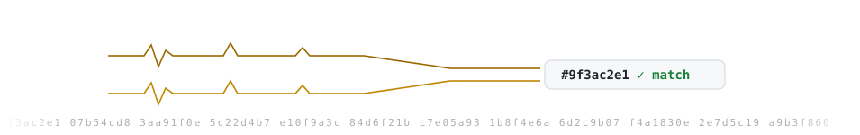
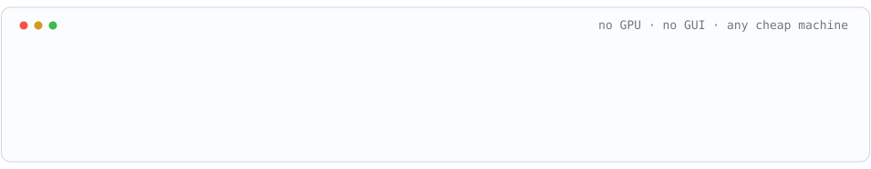
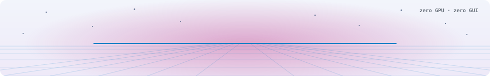

# Context Game Engine

<picture><source media="(prefers-color-scheme: dark)" srcset="docs/img/readme/header-dark.svg"></picture>

Context is a minimal-kernel game engine where **every feature is a package**, built AI-first
without making humans second-class. **Project files are the single source of truth**, and GUI,
CLI, and AI agents are equal clients over one RPC surface — the full authoring loop runs with no
GPU and no GUI, and what you play in the editor is what ships.

<picture><source media="(prefers-color-scheme: dark)" srcset="docs/img/readme/file-flow-dark.svg"></picture>

## Features

- ✅ **Everything is a package** on a minimal kernel — physics, particles, animation, audio, input, UI
- ✅ **File-authoritative** — every edit is a file write; GUI, CLI, and AI agents are equal clients
- ✅ **Windowed editor** — dockable panels, command palette, themes, multi-window tear-out
- ✅ **TypeScript gameplay** on an embedded V8, with a C++/WASM native tier for hot paths
- ✅ **WebGPU rendering** — native and in the browser; 2D is first-class
- ✅ **Deterministic simulation** — same inputs, same state hash, on every machine
- ✅ **One contract** — CLI ≡ RPC ≡ MCP: AI agents get the same surface humans do

## The editor

Requires CMake ≥ 3.25 and **MSVC on Windows / clang on Linux+macOS** — the editor's CEF prebuilt
cannot link under GCC/MinGW.

**Windows** (from a *Developer PowerShell for VS*):

```sh
cmake -S src -B src/build/editor -G Ninja -DCMAKE_BUILD_TYPE=Release -DCONTEXT_BUILD_GUI_CEF=ON
cmake --build src/build/editor --target context context_editor context_editor_webui
```

**Linux / macOS:**

```sh
CC=clang CXX=clang++ cmake -S src -B src/build/editor -G Ninja -DCMAKE_BUILD_TYPE=Release -DCONTEXT_BUILD_GUI_CEF=ON
cmake --build src/build/editor --target context context_editor context_editor_webui
```

The editor lands in `src/build/editor/editor/shell/Release/` and spawns or attaches the project
daemon by itself.

**Run (release mode):**

```sh
src/build/editor/editor/shell/Release/context_editor --project samples/platformer-2d
```

A bare launch (no `--project`) opens the welcome screen.

**Run (dev mode):**

```sh
src/build/editor/editor/shell/Release/context_editor --project samples/platformer-2d --devtools
```

`--devtools` enables Chromium DevTools, `--headless` runs the shell without an OS window,
`--help` lists everything. Add `-DCONTEXT_BUILD_RENDER_WGPU=ON` at configure time for GPU
presentation (without it the editor presents through the CPU fallback).

<picture><source media="(prefers-color-scheme: dark)" srcset="docs/img/readme/determinism-dark.svg"></picture>

## Build & test (engine + CLI)

The headless engine, CLI, and test suite build with any C++20 compiler — no GPU or GUI needed:

```sh
cmake -S src --preset dev
cd src
cmake --build --preset dev
ctest --preset dev
```

Builds land in `src/build/dev/`; the `context` CLI at `src/build/dev/cli/context`.

<picture><source media="(prefers-color-scheme: dark)" srcset="docs/img/readme/headless-terminal-dark.svg"></picture>

<picture><source media="(prefers-color-scheme: dark)" srcset="docs/img/readme/microkernel-orbit-dark.svg"></picture>

## Repository layout

| Directory | Contents |
|---|---|
| `src/kernel/` | The microkernel — the ~6 stable interfaces everything else plugs into |
| `src/editor/` | **EditorKernel** — the file-authoritative project daemon, plus the editor shell + web UI |
| `src/runtime/` | **RuntimeKernel** — the runtime the editor embeds and shipped builds use |
| `src/render/` | WebGPU renderer (native + Emscripten web) |
| `src/packages/` | First-party feature packages (every feature is a package) |
| `src/cli/` | The `context` CLI — one contract registry projected to CLI, RPC, and MCP |
| `samples/` | Runnable sample projects, CI-gated (rots-if-broken) |
| `docs/` | Engineering docs that live with the code |

## License

Source-available under the **Context Engine EULA** (draft — see [LICENSE.md](LICENSE.md)): free
under $200,000/year of gross revenue per product; above that, a 2% marginal royalty on the
revenue above the threshold. **Not open source** — you may build games with it; you may not
build engines from it.

## Contributing

External PRs cannot be merged until the CLA flow exists — see
[CONTRIBUTING.md](.github/CONTRIBUTING.md). Issues, bug reports, and design discussion are
welcome.

<picture><source media="(prefers-color-scheme: dark)" srcset="docs/img/readme/divider-dark.svg"></picture>
